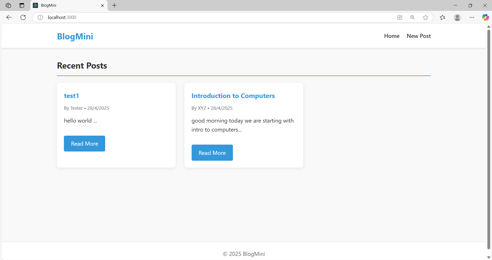
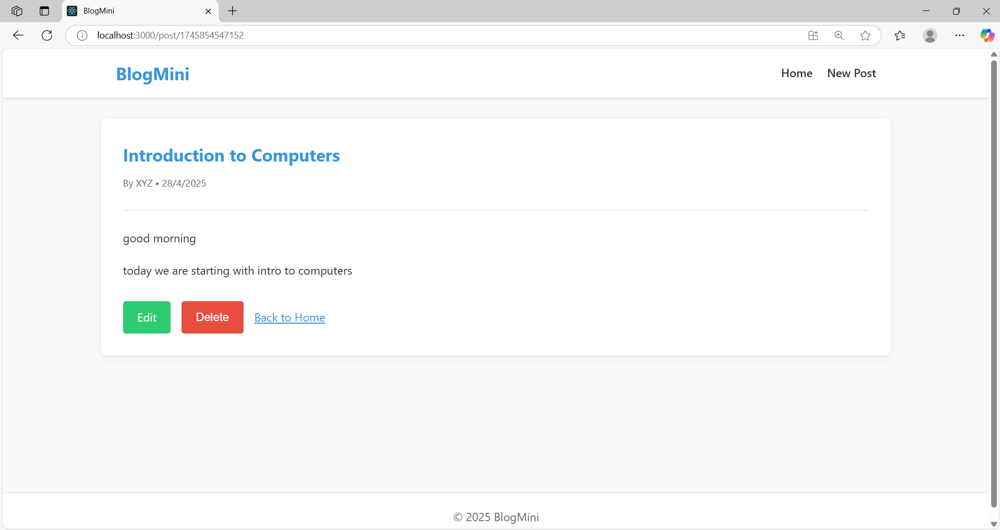
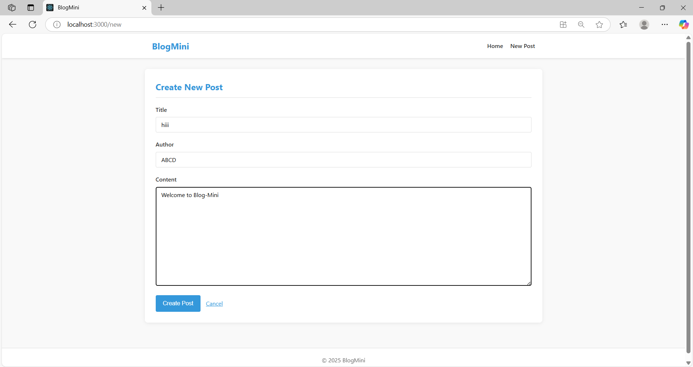

# Blog-Mini 📁

A simple and elegant blog application with CRUD functionality built with React and Node.js.

## Features 🚀

- Create new blog posts
- Browse all posts in a clean interface
- Read individual blog posts with full formatting
- Edit and update existing content
- Delete unwanted posts

## Tech Stack 🧰

- **Frontend**: React
- **Backend**: Node.js with Express
- **Data Storage**: JSON file system
- **Styling**: CSS/SCSS

## Installation ⚙

1. Clone the repository
   ```
   git clone https://github.com/yourusername/blog-website.git
   cd blog-website
   ```

2. Install backend dependencies
   ```
   cd backend
   npm install
   ```

3. Install frontend dependencies
   ```
   cd ../frontend
   npm install
   ```

## Running the Application ⭐

### Start the backend server
```
cd backend
npm run dev
```
The server will run on http://localhost:5000

### Start the React frontend
```
cd frontend
npm start
```
The application will open in your browser at http://localhost:3000

## API Endpoints ⭐

- `GET /api/posts` - Retrieve all blog posts
- `GET /api/posts/:id` - Get a specific post
- `POST /api/posts` - Create a new post
- `PUT /api/posts/:id` - Update a post
- `DELETE /api/posts/:id` - Remove a post

## Screenshots 🏝





## Demo Video 🎥


## Contributing 🌐

Contributions are welcome! Please feel free to submit a Pull Request.
